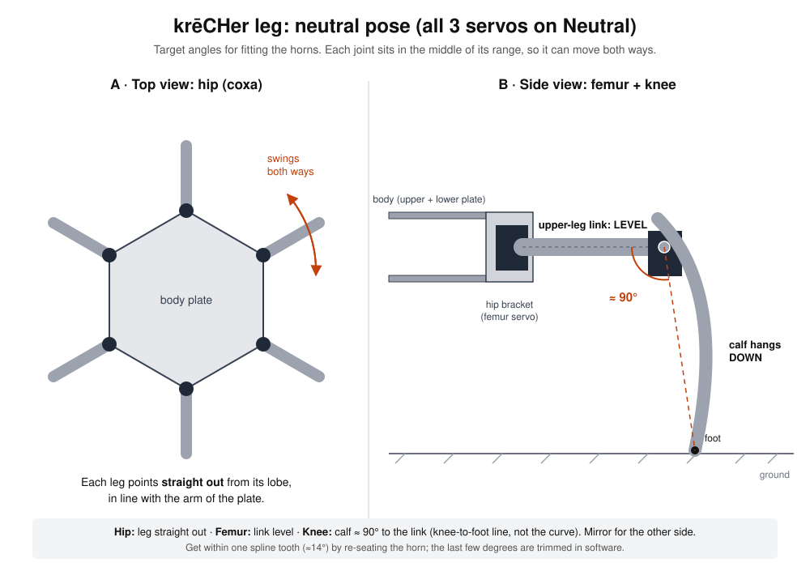
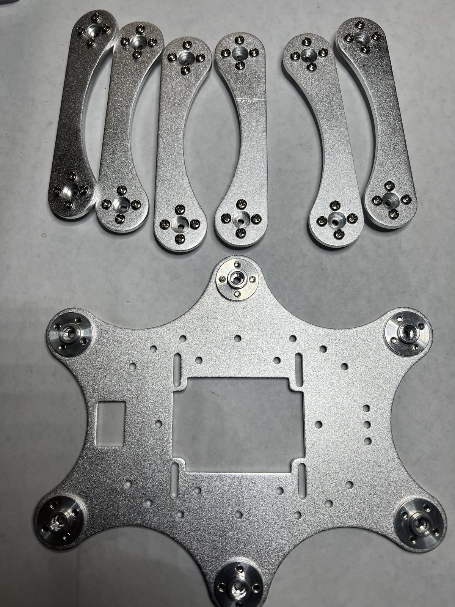
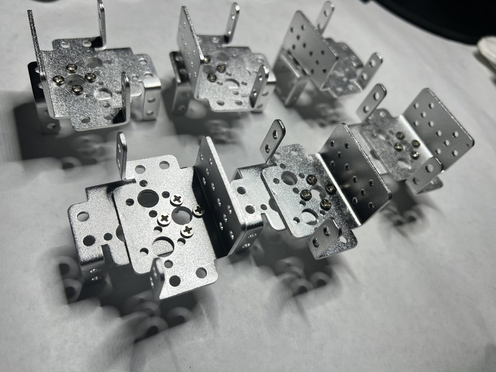
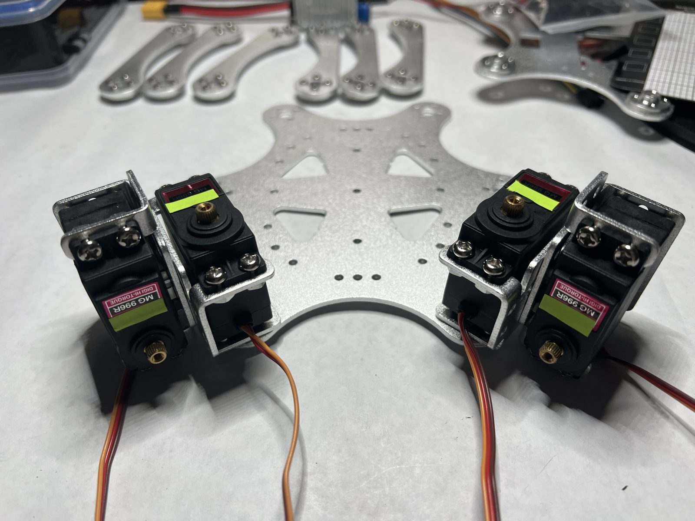
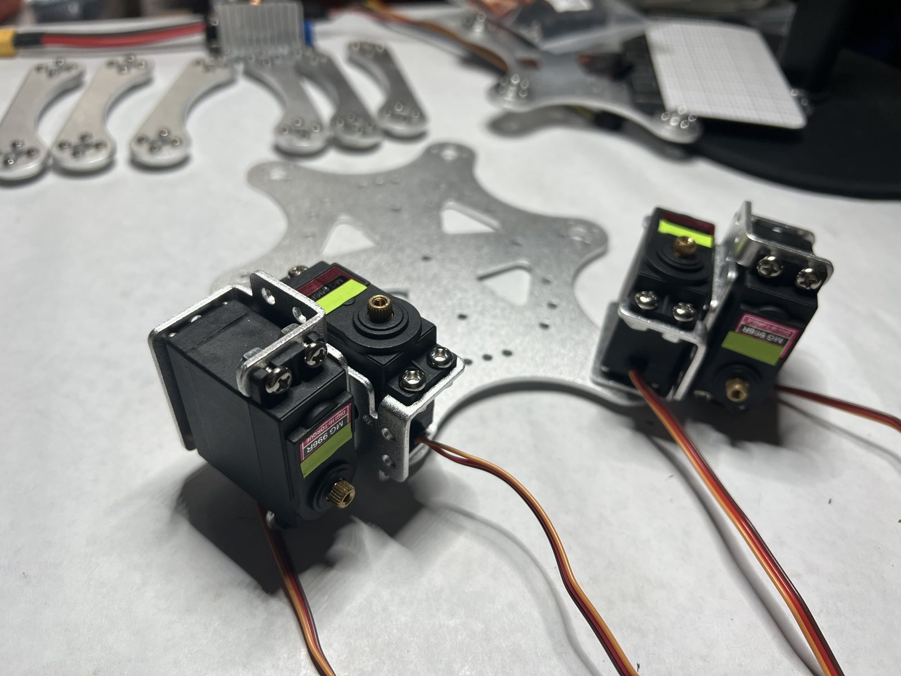
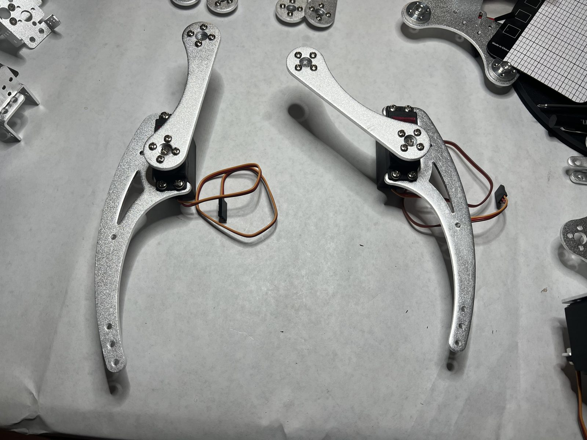
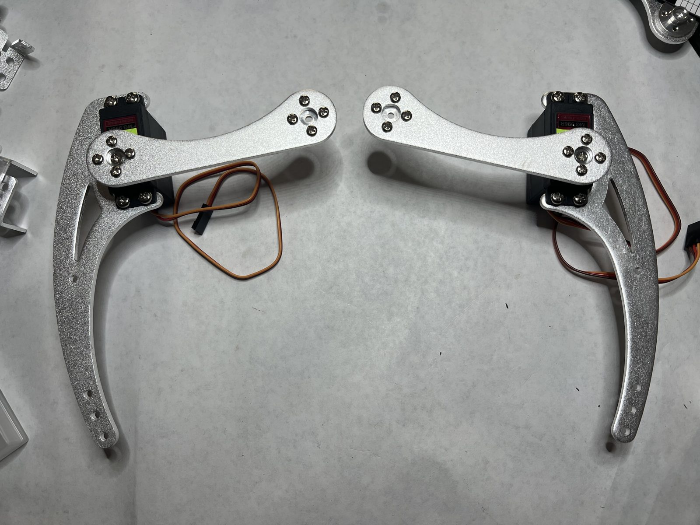
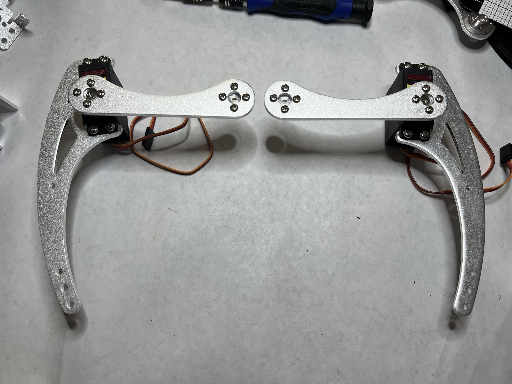

# Leg and body assembly

How krēCHer's hexapod body goes together, step by step, with photos from the actual build. It's written so the body can be rebuilt from scratch, and it records the problems we hit and how we fixed them.

**Status (Oct 5, 2026):** Steps 1–4 are done. Step 5: 2 of 6 hips built. Step 6: 2 of 6 legs built, and these are the reference pair. Steps 7–8 haven't been written yet.

- **Frame:** aluminium hexapod kit (seller: kitsguru), built following the Robokits hexapod guide, which is written for a similar but not identical kit
- **Servos:** 18 × Hosyond MG996R (25T spline), 3 per leg: hip (coxa), upper leg (femur) and knee (tibia)
- **Horns:** 25T aluminium round servo horns, 4 screws each

## Before you start

- **Every servo must be bench-tested and left centred** first ([servo bench test](../servo_test/)). Assembly relies on each shaft still being at Neutral (1500 µs).
- **Don't turn a servo shaft by hand.** An unpowered MG996R can be forced round, and then its neutral no longer matches the frame. Press each horn or link on **once**, at the right step.
- **Left and right are mirror images.** Build the legs in 3 + 3 mirrored sets, never 6 identical.
- **Label every servo** with its number and position (e.g. "#7 – front-left knee"), so calibration maps each one to the right channel.
- One spline step on a 25T servo is about **14.4°**, so the fit by hand is only ever within about 7°. Software trims the rest.

## The target: neutral pose

With all three servos on Neutral, each leg should look like this:

| Joint | Neutral pose |
| --- | --- |
| Hip (coxa) | Leg points **straight out** from its lobe of the body plate |
| Upper leg (femur) | Link is **level** |
| Knee (tibia) | Calf **hangs straight down**, about 90° to the link (measured along the knee-to-foot line, not the curve) |

Each joint sits in the middle of its range, so it can move both ways.

---

## Step 1 · Bench-test and centre the servos

Done Sep 27 and Oct 2: all 20 pass (18 for the legs plus 2 spares), each left at Neutral. See [`../servo_test/`](../servo_test/).

## Step 2 · Fit the horns to the frame parts

- **6 horns on the body plate,** one per lobe. The hub/spline faces up and the flat face sits against the plate.
- **12 horns on the 6 curved upper-leg links,** one at each end, 4 screws each.
- The body plate's centre hole is a shallow pocket for the head of the centre screw. The hub doesn't go into it, so no drilling is needed.
- If the horn screws back out, use blue (medium) threadlocker. Don't use super glue.
- Lay the upper-leg links out 3 + 3, curves facing each other (left and right).
- Check every link for cracks. If you find a faint line, run a fingernail across it: a scratch won't catch.

*Oct 2: 12 horns on the 6 upper-leg links (laid out 3 + 3, curves facing each other) and 6 on the body plate, one per lobe, hub facing up.* **To check:** the 4th link from the left has a faint line across it, about a third of the way down. Run a fingernail across it before that link carries any load.

## Step 3 · Build the hip brackets

- **6 hip pairs:** two multifunction brackets screwed back to back and crossed at 90°, all 12 brackets in total. Each joint gets 4 screws.
- **3 + 3 mirrored:** the Robokits guide sets the top three (one side) differently from the bottom three (the other side).
- Use the same hole pattern and offset on all 6.

*All 6 hip pairs built (Oct 2). Each pair is two brackets screwed back to back, crossed at 90°.* Check that every joint has all 4 screws: from this angle only 2 or 3 show on some pairs.

## Step 4 · Hip pivot (bearing)

The hip turns on one axis, held at the top and bottom. At the top, the hip servo's spline sits in the horn on the upper plate. At the bottom, an M3 screw goes through the bracket into a **bearing** in the lower plate.

- Per hip: 1 × M3 screw, 1 × nut, 1 × miniature ball bearing, so **6 of each** in total. **This kit came without bearings.** Measure the lower plate's pivot hole and order 3 mm bore bearings to fit (e.g. MR83 / 683, flanged if possible).
- **Stand-in until the bearings arrive:** a plain M3 screw and nut through the hole. Keep it snug but loose enough that the joint still turns freely; a nylon lock nut or blue threadlocker stops it backing out.

> **Problem we hit: the servo wouldn't fit.** The stand-in M3 screw was too long and stuck into the space where the hip servo sits.
> **Fix:** we **flipped the screw** so its end points away from the servo, with the nut on the outside. Check that the servo still sits flat on the screw head and doesn't rock. Other options: a shorter screw, washers under the nut, or cutting the screw down (thread a nut on first and back it off afterwards to clean the threads).
> **Right length** = lower plate + bracket wall + washers + nut, plus 1–2 threads. Measure with calipers and pick the nearest stock size (6 / 8 / 10 mm).

## Step 5 · Servos into the hip brackets

Each crossed bracket pair holds two servos:

- **Hip servo:** shaft points **up**, into the horn on the upper body plate.
- **Upper-leg servo:** shaft points **sideways**, driving the hip end of the upper-leg link.

4 screws per servo (M4 screws and nuts in the guide). Build them as mirror pairs.

| | |
| --- | --- |
|  |  |
| **Mirror pair:** the hip servo (shaft up) sits on the **inner** side of each | Same pair from an angle: 4 screws per servo, all seated |

**Checks:**

- Each hip servo sits flat on the pivot screw head and doesn't rock.
- The wires come out where they won't get pinched when the hip swings.
- The servo number and position are written on its tape label.

## Step 6 · Calf + knee servo + upper-leg link

1. Screw the **knee servo** into the calf (4 screws).
2. Press the knee end of the **upper-leg link** onto the knee servo's spline, so the link sits **level** with the calf hanging straight down (about 90°). Do it **once**, with the servo still at Neutral.
3. Put in the **centre screw** last.

**Getting the angle right.** The horn fits onto the spline at 25 positions. A servo can be exactly at Neutral and still have its link at the wrong angle if the horn went on at the wrong step. The fix is to lift the link off and press it back on at a different step, not to turn the servo.

| | |
| --- | --- |
|  |  |
| ✗ **First try:** not a mirror pair. One link is about 20° off the calf's line, the other about 50° | ~ **Second try:** a matched pair, but the links are about 10–15° above level |
|  | |
| ✓ **Reference:** both links level, calves straight down, about 90°, mirrored. **Match the other legs to this one.** | |

**The safest way to re-seat a link:**

1. Take out the link's centre screw.
2. Plug the servo into the tester (buck at ≈5.80 V, wired as in [the bench test](../servo_test/)) and press **Neutral**. Hold the leg clear, because it may jump.
3. Lift the link off the spline and press it back at the step closest to the target.
4. Put the centre screw back in.

> **Note:** the reference pair was re-seated **unpowered**, relying on the shafts still being at Neutral from the bench test. Pressing a link on three times can nudge an unpowered servo a few degrees. This gets checked during calibration (Step 8).

**Checks:**

- Swing the link gently both ways by hand, with the servo unpowered: the wire mustn't get caught between the link and the calf.
- The link doesn't hit the servo body or the calf at either end of its swing.

## Step 7 · Legs onto the body *(to come)*

Fitting the hip assemblies between the lower and upper plates, and pressing the hip servo splines into the body-plate horns.

## Step 8 · Calibration on the Servo 2040 *(to come)*

Send Neutral to every joint and check each leg against the neutral pose. Record each joint's offset below. If a joint is only a few degrees off, trim it in software. If it's more than about 10° off, move its horn one spline step.

| Leg | Hip # / offset | Upper leg # / offset | Knee # / offset |
| --- | --- | --- | --- |
| Front left | | | |
| Middle left | | | |
| Rear left | | | |
| Front right | | | |
| Middle right | | | |
| Rear right | | | |

---

## Parts still needed

- 6+ miniature bearings, 3 mm bore (check the lower plate's hole size first)
- Shorter M3 screws and washers for the hip pivots (ordered)

## Build log

| Date | What happened |
| --- | --- |
| Sep 27, Oct 2 | All 20 servos bench-tested and centred (Step 1) |
| Oct 2 | 18 horns fitted (Step 2, photo); 6 hip bracket pairs built (Step 3, photo) |
| Oct 5 | Hip pivot screw too long, flipped (Step 4); 2 hips built (Step 5); 2 knees built and re-seated until level, now the reference pair (Step 6) |
