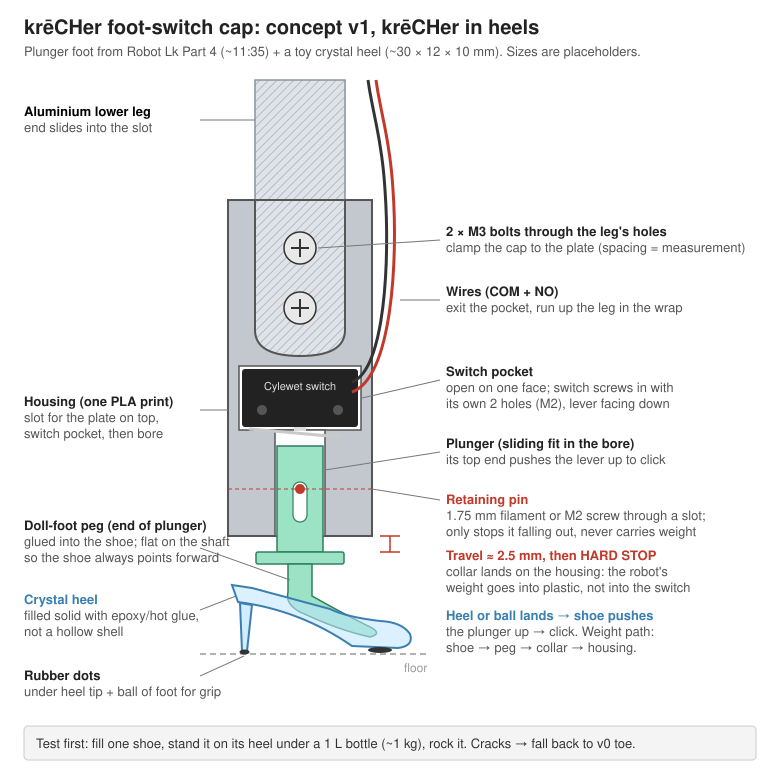

# Feet: foot-contact switches

Each foot gets a Cylewet lever micro-switch so krēCHer knows which feet are on the ground
(all six closed when standing; lifting a leg opens its switch). Wiring: COM → signal on one of
the Servo 2040's six sensor headers, NO → 3.3 V (foot down reads ~3.3 V).

**Status: concept.** Nothing printed yet; sizes in the drawings are placeholders until the leg
and switch are measured.

## Design

The foot is a 3D-printed cap that bolts onto the end of the aluminium lower leg through the
leg's existing holes. A plunger slides in the cap: when the foot lands it moves up about
1.5 mm and clicks the switch, then a collar bottoms out on the cap at about 2.5 mm. From there
the robot's weight goes into the plastic, never into the switch. Idea adapted from Robot Lk's
"Build an 18DOF Hexapod Robot", Part 4 (limit switch setup, ~11:35).

| Drawing | What it shows |
| --- | --- |
| [`foot_switch_cap_v0.svg`](foot_switch_cap_v0.svg) | v0: the cap with a round toe |
| [`foot_switch_heel_v1.svg`](foot_switch_heel_v1.svg) | v1, chosen: krēCHer in heels. The plunger ends in a doll-foot peg glued into a toy crystal high heel (~30 × 12 × 10 mm) |
| [`foot_switch_syringe_v2.svg`](foot_switch_syringe_v2.svg) | v2, prototype without a 3D printer: a 3–5 ml syringe is the housing and plunger, zip-tied beside the leg tip; thread tethers keep the plunger from dropping out; the heel glued to the thumb pad |

## Making the heel work

- Fill each shoe solid with epoxy or hot glue, so it isn't a hollow shell.
- Rubber dots under the heel tip and the ball of the foot for grip.
- A flat on the plunger shaft so the shoe always points forward.

## Next

- [ ] Load test: one filled shoe standing on its heel under ~1 kg (a 1 L bottle), rocked like a
      landing. If it cracks, use the v0 round toe and keep the shoe as decoration.
- [ ] Measure: leg thickness and width at the tip, hole size and spacing, last hole to tip;
      switch body size, its mounting holes, where the lever clicks; the shoe's opening.
- [ ] Build one syringe foot (v2) and test it on one leg.
- [ ] Final six: laser-cut acrylic stack (2D cut files) or a parametric OpenSCAD model → fit-test print → one foot on one leg → all six.
- [ ] Update the leg length in the gait code (the cap adds ~3–4 cm).
