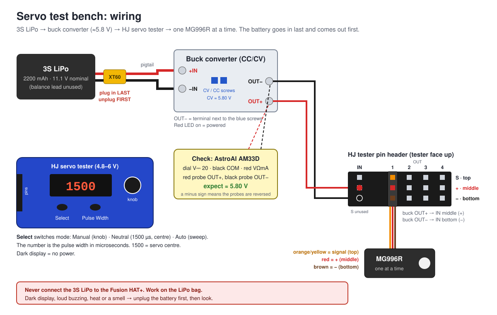
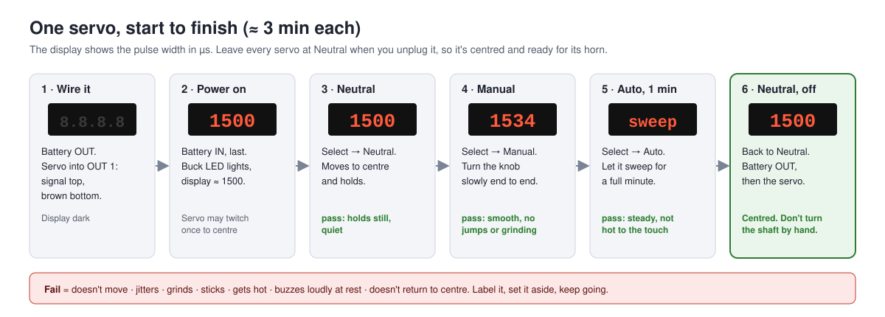
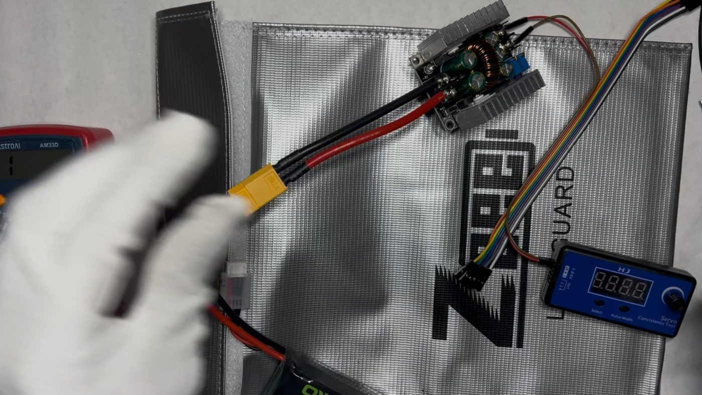
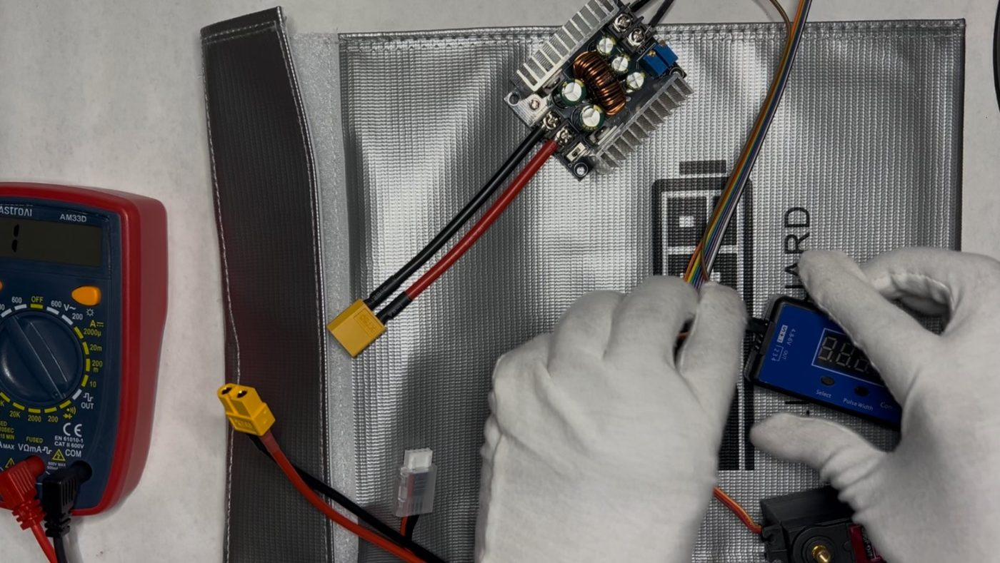
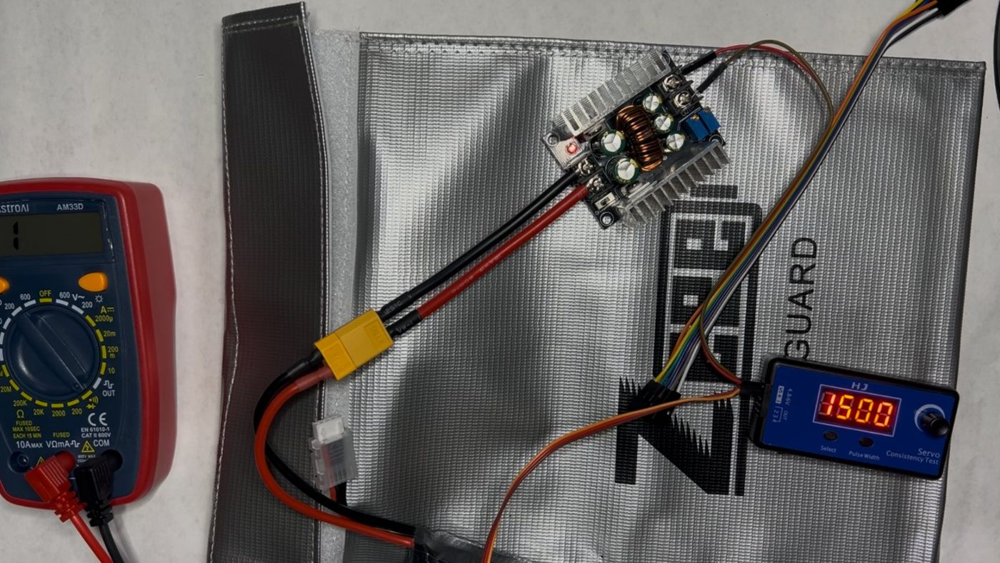
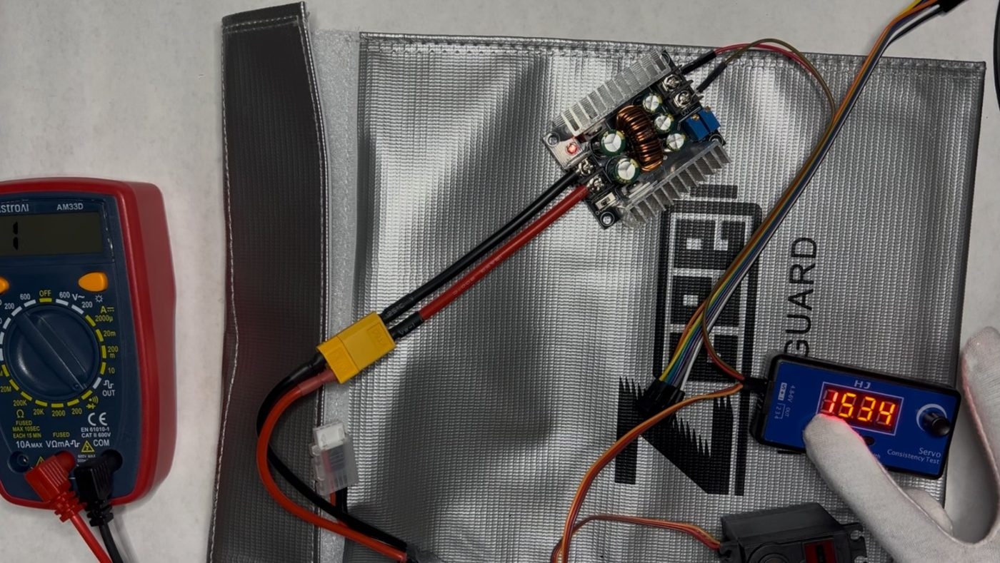
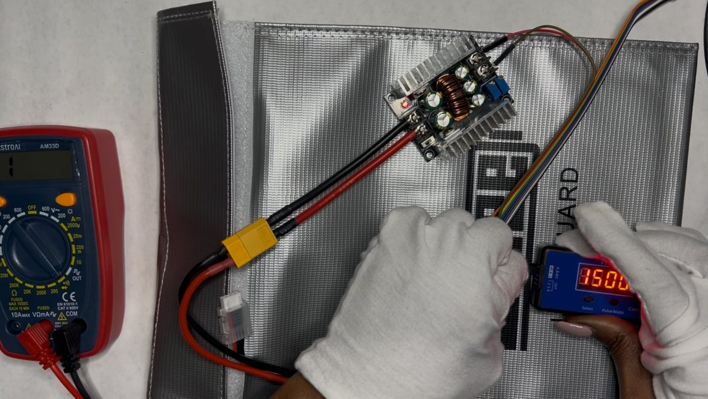

# Servo bench test (MG996R)

Every leg servo is checked on the bench before it goes into the frame. **Status: all 20 tested, 20/20 pass** (1–8 on Sep 27, 9–20 on Oct 2). The test catches dead or noisy servos while they're still easy to swap, and it ends with each servo **centred**, ready for its horn.

- **Servos:** Hosyond MG996R (metal gear), 20 in total: 18 for the legs and 2 spares
- **Tester:** HJ 4-output digital servo tester ("Servo Consistency Test"), rated 4.8–6 V
- **Power:** OVONIC 3S LiPo 2200 mAh → XT60 pigtail → CC/CV buck converter set to **≈ 5.80 V**
- **Meter:** AstroAI AM33D

The servos are tested at 5.80 V, the same as the first batch, so every servo has been checked the same way. The buck goes up to 6.0 V later, when it powers the Servo 2040 and the legs need more torque.

## Wiring

| From | To |
| --- | --- |
| Battery XT60 | XT60 pigtail: **red → +IN**, **black → −IN** on the buck |
| Buck **OUT+** | Tester **IN**, middle pin (+) |
| Buck **OUT−** (next to the blue screws) | Tester **IN**, bottom pin (−) |
| Tester IN, top pin (S) | nothing |
| Servo plug | Tester **OUT 1**: signal (orange/yellow) on **top**, red in the **middle**, brown on the **bottom** |

With the tester face up, the pins are **S on top, + in the middle, − on the bottom**.

## Before you start

1. Put a strip of tape on each servo and number it, so the results match the table below.
2. Work on the LiPo bag, with the battery unplugged.
3. Set the meter: black lead in **COM**, red lead in **VΩmA**, dial on **V⎓ 20**.
4. Plug the battery into the pigtail and measure the buck output: red probe on OUT+, black probe on OUT−. It should read **≈ 5.80 V**. If it has drifted, turn the **CV** screw to bring it back. (A minus sign means the probes are the wrong way round.)
5. **Unplug the battery.**

## Test one servo

1. **Wire it.** With the battery unplugged, plug the servo into OUT 1: signal on top, brown on the bottom. The display is dark.
2. **Power on.** Plug the battery in **last**. The buck's red LED comes on and the display shows about **1500**. The servo may twitch once as it finds the centre.
3. **Neutral.** Press **Select** until the tester is in Neutral. The servo moves to the centre (1500 µs) and holds there.
4. **Manual.** Press Select to switch to Manual and turn the knob **slowly** from one end to the other. The number changes as you turn (e.g. 1534), and the servo should move smoothly, with no jumps, grinding or dead spots.
5. **Auto.** Press Select to switch to Auto and let it sweep for a **full minute**.
6. **Back to Neutral, then off.** Return to Neutral. The servo goes back to the centre and goes quiet (a faint hum is fine). **Unplug the battery first, then the servo.** The servo is now centred: don't turn its shaft by hand before the horn goes on.
7. Record pass or fail in the table below and start again from step 1 with the next servo.

**A servo fails if it:** doesn't move, jitters, grinds, sticks, gets hot, buzzes loudly at rest, or doesn't return to the centre. Mark the tape "FAIL", set it aside and carry on.

## Photos from the first batch (servos 1–8, Sep 27)

| | |
| --- | --- |
|  |  |
| **Start:** battery unplugged (XT60 apart), display dark | **Wiring:** plugging in a servo while the battery is out |
|  |  |
| **Neutral:** battery in, buck LED on, display **1500** | **Manual:** turning the knob, display **1534** |
|  | |
| **End:** back to Neutral (1500) before unplugging | |

## Safety

- The battery goes in **last** and comes out **first**, every time you change a wire or step away.
- One servo on the tester at a time.
- If the display stays dark, or you notice loud buzzing, heat or a smell: **unplug the battery first**, then look.
- **Never** connect the 3S LiPo to the Fusion HAT+ (it takes only its own 2S battery or USB-C).
- When you're done, put the packs back in the LiPo bag.

## Results

| Servo | Date | Neutral | Manual | Auto 1 min | Returns to centre | Result | Notes |
| ---: | --- | :---: | :---: | :---: | :---: | :---: | --- |
| 1 | 2026-09-27 | ✓ | ✓ | ✓ | ✓ | **PASS** | |
| 2 | 2026-09-27 | ✓ | ✓ | ✓ | ✓ | **PASS** | |
| 3 | 2026-09-27 | ✓ | ✓ | ✓ | ✓ | **PASS** | |
| 4 | 2026-09-27 | ✓ | ✓ | ✓ | ✓ | **PASS** | |
| 5 | 2026-09-27 | ✓ | ✓ | ✓ | ✓ | **PASS** | |
| 6 | 2026-09-27 | ✓ | ✓ | ✓ | ✓ | **PASS** | |
| 7 | 2026-09-27 | ✓ | ✓ | ✓ | ✓ | **PASS** | |
| 8 | 2026-09-27 | ✓ | ✓ | ✓ | ✓ | **PASS** | |
| 9 | 2026-10-02 | ✓ | ✓ | ✓ | ✓ | **PASS** | |
| 10 | 2026-10-02 | ✓ | ✓ | ✓ | ✓ | **PASS** | |
| 11 | 2026-10-02 | ✓ | ✓ | ✓ | ✓ | **PASS** | |
| 12 | 2026-10-02 | ✓ | ✓ | ✓ | ✓ | **PASS** | |
| 13 | 2026-10-02 | ✓ | ✓ | ✓ | ✓ | **PASS** | |
| 14 | 2026-10-02 | ✓ | ✓ | ✓ | ✓ | **PASS** | |
| 15 | 2026-10-02 | ✓ | ✓ | ✓ | ✓ | **PASS** | |
| 16 | 2026-10-02 | ✓ | ✓ | ✓ | ✓ | **PASS** | |
| 17 | 2026-10-02 | ✓ | ✓ | ✓ | ✓ | **PASS** | |
| 18 | 2026-10-02 | ✓ | ✓ | ✓ | ✓ | **PASS** | |
| 19 | 2026-10-02 | ✓ | ✓ | ✓ | ✓ | **PASS** | |
| 20 | 2026-10-02 | ✓ | ✓ | ✓ | ✓ | **PASS** | |

## After the test: fitting horns

Press each centred servo's horn on before anything turns the shaft. The aluminium disc horn goes **hub down onto the servo spline, flat face up**; the body plate sits on the flat face (its pocket side facing away), and the centre screw goes through the pocket into the servo shaft, with 4 short screws through the plate into the horn's threaded holes.
