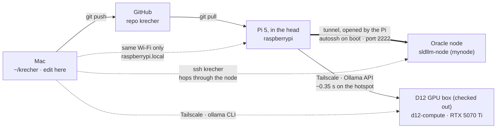
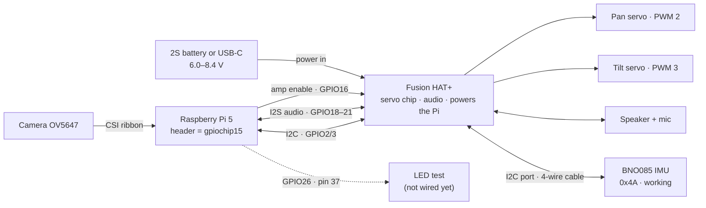
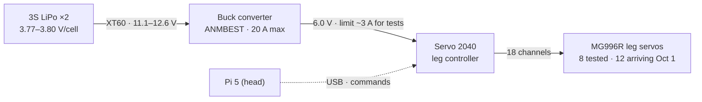
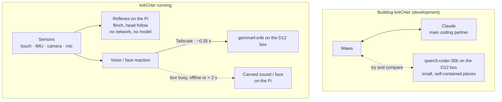

# krēCHer System Map

As of Oct 1, 2026. How the Mac, GitHub, the Oracle node, the D12 GPU box and the Pi talk to each other, what sits inside the head, how the body is powered, and where the language models fit.

## 1. Who talks to whom

The Pi dials out to the node, so no router settings are needed and it works from any Wi-Fi. The node is a meeting point: the Mac connects to it, then follows the tunnel back to the Pi. Code travels separately: the Mac pushes to GitHub, the Pi pulls.

The D12 box joins my Tailscale network while it's checked out from the class's lab checkout system. Its Ollama address changes with each checkout, so it lives in one config value. On the hotspot the Pi's link goes through Tailscale's relay (~0.3 s); the Mac on home Wi-Fi gets a direct link (~22 ms).

## 2. Inside the head

The Pi talks to the HAT through its 40-pin header: I2C carries servo commands, I2S carries sound, and GPIO16 switches the amplifier on. Free pins confirmed: GPIO5, 12, 13, 23, 24, 25, 26. The BNO085 plugs into the HAT's own 4-pin I2C port (no soldering) and shares the bus with the HAT (0x17). USB-C goes into the HAT (never the Pi's own port) and can be plugged in while the Pi is running; it charges the 2S battery at the same time.

## 3. Body power

The head and body have separate power. The HAT runs on its own 2S battery; the legs run on the 3S LiPo through the buck converter.

> ⚠️ **Never connect the 3S LiPo (or the LiPo charger) to the Fusion HAT+.** The HAT takes only its own 2S battery or USB-C.

## 4. Where the language models fit (decided Oct 1)

Two separate jobs, two separate choices. The reflexes use no model at all.

- **Writing the code:** me with Claude (commits carry a `Co-Authored-By: Claude` trailer). qwen3-coder:30b is the best local coder tested so far, so it's worth trying on small pieces and for comparison, but it only sees what's pasted in and only works while a box is checked out.
- **krēCHer's voice:** gemma4:e4b on the D12 box. Warm reply in 0.06 s on the box, 0.35 s round trip from the Pi on the hotspot; stays in character ("Ouch!").
- **Reflexes:** the flinch and head-follow run on the Pi from sensor data. A reflex can't wait 0.35 s or depend on Wi-Fi.
- **Fallback:** one warm-up request at startup (a cold model takes ~2 s); if a reply takes more than ~2 s or the box isn't available, play a canned reaction instead of stalling.
- Measurements and the model comparison: [`model_benchmarks.md`](model_benchmarks.md).

## Progress

- [x] **Sprint 1 · Housekeeping:** batteries checked, buck converter rated, parts ordered.
- [x] **Sprint 2 · Mac ↔ Pi code loop:** edit, push, pull and run works.
- [x] **Sprint 3 · Tunnel on boot:** autossh service survives a reboot. `ssh krecher` reaches the Pi from anywhere.
- [x] **Sprint 4 · BNO085:** wired to the HAT's I2C port; orientation reads cleanly.
- [x] **Sprint 5 · Logged IMU trial:** 1,500 readings, 0 errors.
- [x] **Sprint 6 · Head follows the IMU:** first sense → react loop.
- [x] **Body power + servo test (Sep 27):** buck set; 8/8 MG996Rs pass.
- [x] **Servo 2040 on USB (Sep 28).**
- [x] **Sprint 7 · Pi ↔ D12 box (Oct 1):** the Pi asked gemma4:e4b on the box and got "Ouch!" in 0.35 s.
- [ ] **Next:** test the 12 new servos and build the first two legs.

## Commands I reuse

| Command | Run on | What it does |
| --- | --- | --- |
| `ssh krecher` | Mac | Log in to the Pi from anywhere, through the node |
| `ssh krecher@raspberrypi.local` | Mac | Log in directly when both are on the same Wi-Fi |
| `git push` / `git pull` | Mac / Pi | Send code up from the Mac, bring it down on the Pi |
| `systemctl status krecher-tunnel` | Pi | Check the tunnel is running |
| `journalctl -u krecher-tunnel -n 50` | Pi | See why the tunnel stopped, if it did |
| `gpioinfo gpiochip15` | Pi | See which pins are free before wiring |
| `source ~/venvs/imu/bin/activate` | Pi | Enter the IMU / head Python environment |
| `i2cdetect -y 1` | Pi | List I2C devices (HAT = 17, BNO085 = 4a) |
| `tailscale status` / `tailscale ping <ip>` | Mac / Pi | See the Tailscale devices; check direct vs relay |
| `export OLLAMA_HOST=<box url>` then `ollama run <model> --verbose` | Mac | Use the D12 box's models from the Mac's Terminal |
| `ollama run <model> --nowordwrap` | Mac | Use when the output is code you'll copy |
